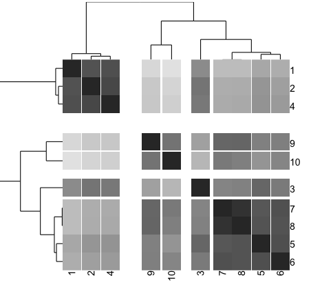
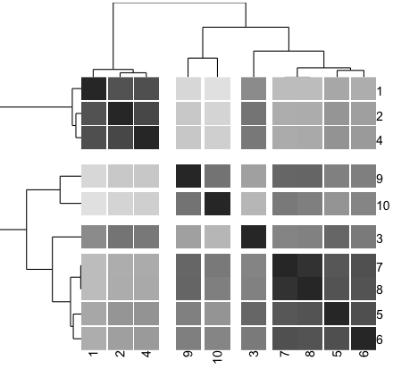
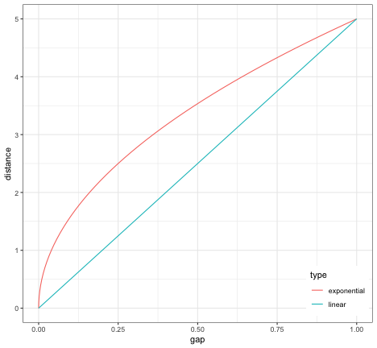
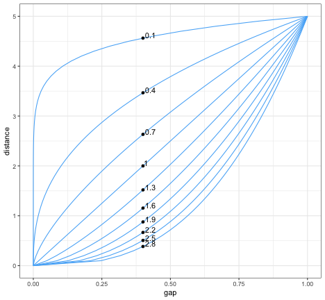
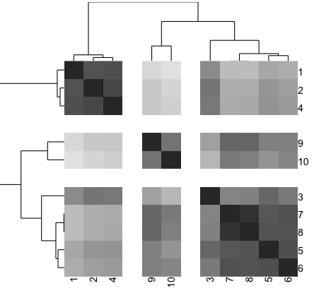
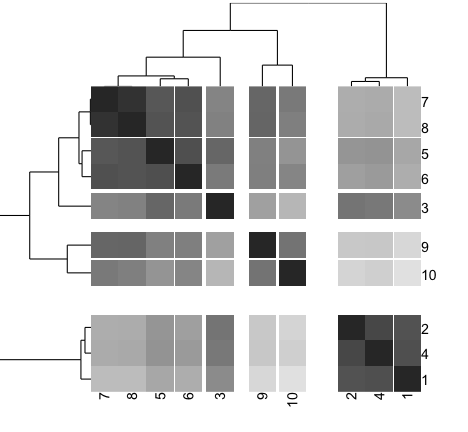

# An introduction to the gapmap package

This document explains basic functions of the `gapmap` package to draw a gapped cluster heatmap. The plot is generated using the `ggplot2` package.
Let's load the library first.

```r
library(gapmap)
```


We will simulate a simple dataset.

```r
set.seed(1234)
x <- rnorm(10, mean=rep(1:5, each=2), sd=0.4)
y <- rnorm(10, mean=rep(c(1,2), each=5), sd=0.4)
dataFrame <- data.frame(x=x, y=y, row.names=c(1:10))
#calculate distance matrix. default is Euclidean distance
distxy <- dist(dataFrame)
#perform hierarchical clustering. default is complete linkage.
hc <- hclust(distxy)
dend <- as.dendrogram(hc)
```

To make a gapped cluster heatmap, you need to pass a `matrix` object for heatmap, and `dendrogram` class objects for drawing dendrograms and ordering.


```r
grey_scale =c("#333333", "#5C5C5C", "#757575", "#8A8A8A", "#9B9B9B", "#AAAAAA", "#B8B8B8", "#C5C5C5", "#D0D0D0", "#DBDBDB", "#E6E6E6")
gapmap(m = as.matrix(distxy), d_row= rev(dend), d_col=dend, col = grey_scale)
```

```
## Warning: `panel.margin` is deprecated. Please use `panel.spacing` property
## instead

## Warning: `panel.margin` is deprecated. Please use `panel.spacing` property
## instead

## Warning: `panel.margin` is deprecated. Please use `panel.spacing` property
## instead

## Warning: `panel.margin` is deprecated. Please use `panel.spacing` property
## instead
```



The default of `gapmap` function is in the **quantitative** mode and uses **exponential** mapping. First, you can choose either modes: **quantitative** or **threshold**.

* **quantitative**: the size of gap is quantitatively mapped to the distance/height at which two nodes merges in hierarchical clustering. For mapping the distance, you have 2 options: **linear** or **exponential** mapping.
    + **linear**: The distance and the size of a gap is linearly mapped.
    + **exponential**:  The distance and the size of a gap is linearly mapped.  The scale log base can be set with **scale** attribute. The default scale is set to 0.5.

* **threshold**: the gaps are introduced based on the "cutting the tree" method.  By setting **threshold** attributes, or alternatively **row_threshold** and **col_threshold**, you can divide into clusters and introduce the gaps between clusters.

The following example uses the linear mapping. This mapping generate more gaps, whereas the previous example of exponential mapping emphasize on the large gaps. 

```r
gapmap(m = as.matrix(distxy), d_row= rev(dend), d_col=dend,  mode = "quantitative", mapping="linear", col = grey_scale)
```

```
## Warning: `panel.margin` is deprecated. Please use `panel.spacing` property
## instead

## Warning: `panel.margin` is deprecated. Please use `panel.spacing` property
## instead

## Warning: `panel.margin` is deprecated. Please use `panel.spacing` property
## instead

## Warning: `panel.margin` is deprecated. Please use `panel.spacing` property
## instead
```




The following example illustrate the difference of two mapping schemes. For the exponential mapping, the scale log base is set to 0.5.


The variation of scale log base settings is illustrated in the following plot.  The value of scale is annotated on the plot.



Besides the **quantitative** mode, there is **linear** mode to introduce gap by a threshold. In the following example, the dendrograms for rows and columns are cut at the threshold distance of 2 and gaps of the same size are introduced between clusters. 


```r
gapmap(m = as.matrix(distxy), d_row= rev(dend), d_col=dend,  mode = "threshold", row_threshold = 2, col_threshold = 2, col = grey_scale)
```

```
## Warning: `panel.margin` is deprecated. Please use `panel.spacing` property
## instead

## Warning: `panel.margin` is deprecated. Please use `panel.spacing` property
## instead

## Warning: `panel.margin` is deprecated. Please use `panel.spacing` property
## instead

## Warning: `panel.margin` is deprecated. Please use `panel.spacing` property
## instead
```



In addition, this package works well with our dendrogram sorting package, called `dendsort`. For the details on dendsort, please check our [paper](https://f1000research.com/articles/3-177/v1/).


```r
library(dendsort);
gapmap(m = as.matrix(distxy), d_row= rev(dendsort(dend)), d_col=dendsort(dend),  mode = "quantitative", col = grey_scale)
```

```
## Warning: `panel.margin` is deprecated. Please use `panel.spacing` property
## instead

## Warning: `panel.margin` is deprecated. Please use `panel.spacing` property
## instead

## Warning: `panel.margin` is deprecated. Please use `panel.spacing` property
## instead

## Warning: `panel.margin` is deprecated. Please use `panel.spacing` property
## instead
```



