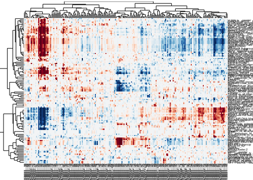
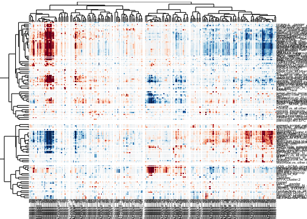
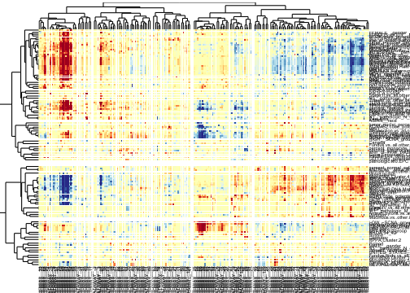
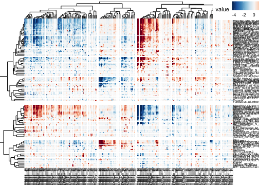
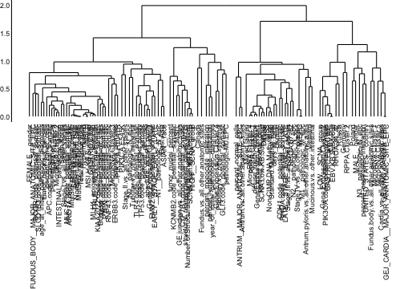
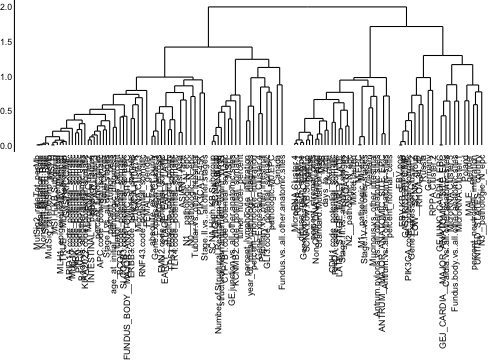

# Example with a TCGA dataset

This is an R Markdown document, which demonstrates the use of **gapmap** and **dendsort** packages to generate a gapped cluster heatmap visualization.


Let's start by loading the data file from the package, and creating two color palettes.

```r
library(gapmap)
```

```
## Loading required package: ggplot2
```

```
## Loading required package: reshape2
```

```r
data("sample_tcga")
library(RColorBrewer)
RdBu = rev(brewer.pal(11, name="RdBu"))
RdYlBu = rev(brewer.pal(11, name="RdYlBu"))
```

Now you have the data matrix loaded, let's calculate correlation-based distance and perform hierarchical clustering. In this example, we use the correlation-based dissimilarity (Pearson Correlation) and the complete linkage for hierarchical clustering. 

```r
#transpose
dataTable <- t(sample_tcga)
#calculate the correlation based distance
row_dist <- as.dist(1-cor(t(dataTable), method = "pearson"))
col_dist <- as.dist(1-cor(dataTable, method = "pearson"))
#hierarchical clustering
col_hc <- hclust(col_dist, method = "complete")
row_hc <- hclust(row_dist, method = "complete")
col_d <- as.dendrogram(col_hc)
row_d <- as.dendrogram(row_hc)
```


Now you are ready to plot the data. First, we will plot a cluster heatmap without any gaps. 


```r
gapmap(m = as.matrix(dataTable), d_row = rev(row_d), d_col = col_d, ratio = 0, verbose=FALSE, col=RdBu,
       label_size=2, v_ratio= c(0.1,0.8,0.1), h_ratio=c(0.1,0.8,0.1))
```

```
## Warning: `panel.margin` is deprecated. Please use `panel.spacing` property
## instead

## Warning: `panel.margin` is deprecated. Please use `panel.spacing` property
## instead

## Warning: `panel.margin` is deprecated. Please use `panel.spacing` property
## instead

## Warning: `panel.margin` is deprecated. Please use `panel.spacing` property
## instead
```



This `gapmap` package was designed to encode the similarity between two nodes by adjusting the position of each leaves. In the traditional representation, all the information about the similarity two adjacent nodes is in the height of the branch in a dendrogram. By positioning leaves based on the similarity, we introduce gaps in both dendrograms and heat map visualization. In the figure below, we exponentially map a distance (dissimilarity) of two nodes to a scale of gap size.  


```r
gapmap(m = as.matrix(dataTable), d_row = rev(row_d), d_col = col_d, mode = "quantitative", mapping="exponential", col=RdBu,
       ratio = 0.3, verbose=FALSE, scale = 0.5, label_size=2, v_ratio= c(0.1,0.8,0.1), h_ratio=c(0.1,0.8,0.1))
```

```
## Warning: `panel.margin` is deprecated. Please use `panel.spacing` property
## instead

## Warning: `panel.margin` is deprecated. Please use `panel.spacing` property
## instead

## Warning: `panel.margin` is deprecated. Please use `panel.spacing` property
## instead

## Warning: `panel.margin` is deprecated. Please use `panel.spacing` property
## instead
```



Since the background is white, we can use another color scale where the value 0 is encoded in yellow. 


```r
gapmap(m = as.matrix(dataTable), d_row = rev(row_d), d_col = col_d, mode = "quantitative", mapping="exponential", col=RdYlBu,
       ratio = 0.3, verbose=FALSE, scale = 0.5, label_size=2, v_ratio= c(0.1,0.8,0.1), h_ratio=c(0.1,0.8,0.1))
```

```
## Warning: `panel.margin` is deprecated. Please use `panel.spacing` property
## instead

## Warning: `panel.margin` is deprecated. Please use `panel.spacing` property
## instead

## Warning: `panel.margin` is deprecated. Please use `panel.spacing` property
## instead

## Warning: `panel.margin` is deprecated. Please use `panel.spacing` property
## instead
```



## dendsort ##
This package works well with the **dendsort** package to reorder the structure of dendrograms. For further information for the **dendsort**, please see the [paper](https://f1000research.com/articles/3-177/v1).


```r
library(dendsort)
gapmap(m = as.matrix(dataTable), d_row = rev(dendsort(row_d, type = "average")), d_col = dendsort(col_d, type = "average"),  
       mode = "quantitative", mapping="exponential", ratio = 0.3, verbose=FALSE, scale = 0.5, v_ratio= c(0.1,0.8,0.1), 
       h_ratio=c(0.1,0.8,0.1), label_size=2, show_legend=TRUE, col=RdBu)
```

```
## Warning: `panel.margin` is deprecated. Please use `panel.spacing` property
## instead

## Warning: `panel.margin` is deprecated. Please use `panel.spacing` property
## instead

## Warning: `panel.margin` is deprecated. Please use `panel.spacing` property
## instead

## Warning: `panel.margin` is deprecated. Please use `panel.spacing` property
## instead
```



## dendrograms ##
You can also plot gapped dendrogram. First you need to create a `gapdata` class object by calling `gap_data()`.  To bring the text labels closer to the dendrogram, we set a negative value to `axis.tick.margin`. This value should be adjusted depending on your plot size. If anyone has a better solution to adjust the position of the axis labels, please let me know.  

```r
row_data <- gap_data(d= row_d, mode = "quantitative", mapping="exponential", ratio=0.3, scale= 0.5)
dend <- gap_dendrogram(data = row_data, leaf_labels = TRUE, rotate_label = TRUE)
```

```
## Warning: `panel.margin` is deprecated. Please use `panel.spacing` property
## instead
```

```r
dend + theme(axis.ticks.length= grid::unit(0,"lines") )+ theme(axis.ticks.margin = grid::unit(-0.8, "lines"))
```

```
## Warning: `axis.ticks.margin` is deprecated. Please set `margin` property of
## `axis.text` instead
```



Here, we can also apply `dendsort`.

```r
row_data <- gap_data(d= dendsort(row_d, type = "average"), mode = "quantitative", mapping="exponential", ratio=0.3, scale= 0.5)
dend <- gap_dendrogram(data = row_data, leaf_labels = TRUE, rotate_label = TRUE)
```

```
## Warning: `panel.margin` is deprecated. Please use `panel.spacing` property
## instead
```

```r
dend + theme(axis.ticks.length= grid::unit(0,"lines") )+ theme(axis.ticks.margin = grid::unit(-0.8, "lines"))
```

```
## Warning: `axis.ticks.margin` is deprecated. Please set `margin` property of
## `axis.text` instead
```




